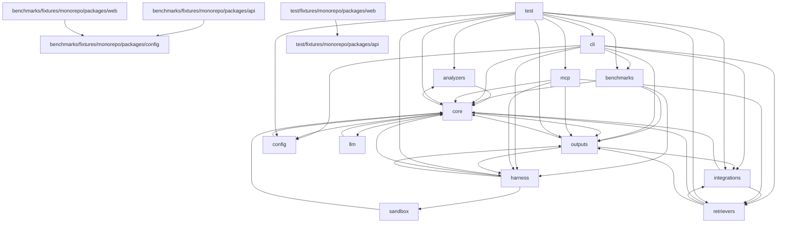

# Dependency Graph

## Module Graph

## Module Edges
| From | To | Count |
| --- | --- | --- |
| analyzers | core | 5 |
| benchmarks | core | 5 |
| benchmarks | harness | 6 |
| benchmarks | outputs | 7 |
| benchmarks/fixtures/monorepo/packages/api | benchmarks/fixtures/monorepo/packages/config | 1 |
| benchmarks/fixtures/monorepo/packages/web | benchmarks/fixtures/monorepo/packages/config | 1 |
| cli | benchmarks | 2 |
| cli | config | 1 |
| cli | core | 10 |
| cli | harness | 7 |
| cli | integrations | 1 |
| cli | outputs | 10 |
| cli | retrievers | 1 |
| config | core | 2 |
| core | analyzers | 4 |
| core | config | 1 |
| core | llm | 1 |
| core | outputs | 3 |
| harness | core | 17 |
| harness | outputs | 26 |
| harness | sandbox | 3 |
| integrations | core | 2 |
| integrations | retrievers | 1 |
| llm | core | 1 |
| mcp | core | 1 |
| mcp | harness | 3 |
| mcp | outputs | 7 |
| mcp | retrievers | 2 |
| outputs | core | 34 |
| outputs | harness | 14 |
| outputs | integrations | 2 |
| retrievers | core | 4 |
| retrievers | integrations | 1 |
| retrievers | outputs | 2 |
| sandbox | core | 4 |
| test | analyzers | 3 |
| test | benchmarks | 2 |
| test | cli | 2 |
| test | config | 3 |
| test | core | 44 |
| test | harness | 13 |
| test | integrations | 1 |
| test | mcp | 1 |
| test | outputs | 22 |
| test | retrievers | 1 |
| test/fixtures/monorepo/packages/web | test/fixtures/monorepo/packages/api | 1 |
