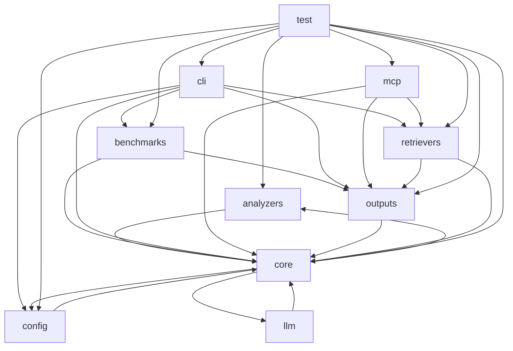

# Dependency Graph

## Module Graph

## Module Edges
| From | To | Count |
| --- | --- | --- |
| analyzers | core | 5 |
| benchmarks | core | 2 |
| benchmarks | outputs | 3 |
| cli | benchmarks | 1 |
| cli | config | 1 |
| cli | core | 7 |
| cli | outputs | 9 |
| cli | retrievers | 1 |
| config | core | 2 |
| core | analyzers | 4 |
| core | config | 1 |
| core | llm | 1 |
| llm | core | 1 |
| mcp | core | 1 |
| mcp | outputs | 5 |
| mcp | retrievers | 2 |
| outputs | core | 29 |
| retrievers | core | 3 |
| retrievers | outputs | 2 |
| test | analyzers | 3 |
| test | benchmarks | 1 |
| test | cli | 1 |
| test | config | 3 |
| test | core | 23 |
| test | mcp | 1 |
| test | outputs | 11 |
| test | retrievers | 1 |
