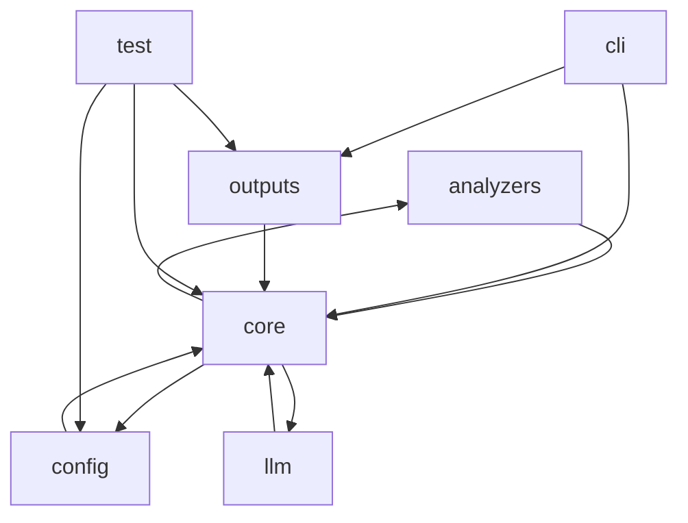

# Dependency Graph

## Module Graph

## Module Edges
| From | To | Count |
| --- | --- | --- |
| analyzers | core | 4 |
| cli | core | 5 |
| cli | outputs | 4 |
| config | core | 2 |
| core | analyzers | 4 |
| core | config | 1 |
| core | llm | 1 |
| llm | core | 1 |
| outputs | core | 15 |
| test | config | 1 |
| test | core | 6 |
| test | outputs | 1 |
