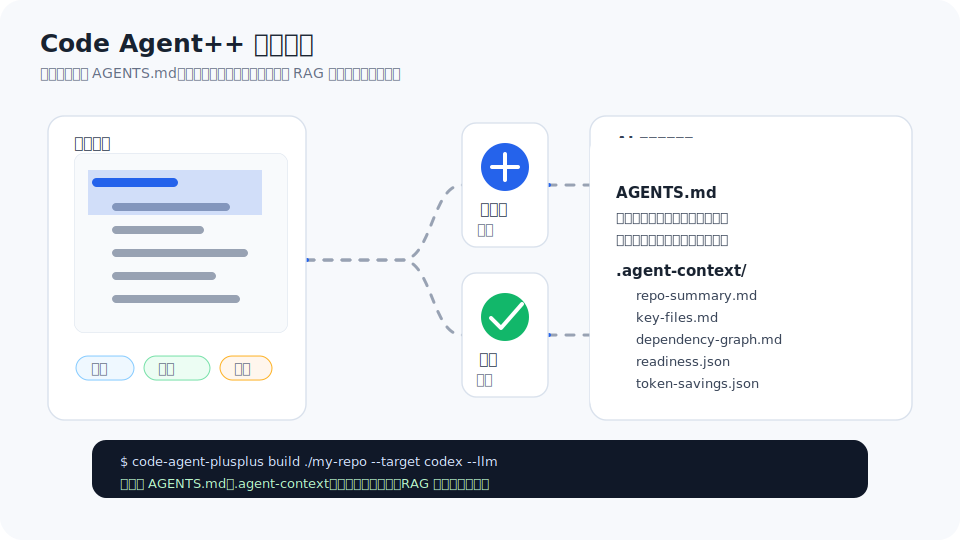

# Repo-to-Agent-Context

中文 | [English](README.en.md)

Repo-to-Agent-Context 是面向 AI 编程 Agent 的 Harness Runtime 控制面。

它不替代 Codex / Claude Code / Cursor / OpenCode / MiMoCode 写代码，而是把仓库编译成 task-aware context，生成编辑边界，记录执行轨迹，检查策略与 contracts，分析 diff 影响，推荐测试与验证路径，并根据 freshness / trace / policy / impact 决定下一轮动作。

核心闭环：

```txt
Context -> Agent -> Execution -> Trace -> Evaluation -> Context Update -> Loop
```

它不是简单 repo summarizer，也不只是 context pack tool。它的目标是给 Codex / Claude Code / Cursor / OpenCode / MiMoCode 增加一个静态但可验证的工程控制面：更少乱读、更少乱改，改完知道怎么验证，并能根据 trace、policy、tests、diff 和 freshness 进入下一轮修复或收口。

当前实现更准确地说是 Context / Policy / Trace 报告系统 + 显式 runtime 状态机 + 半自动 loop 建议器：它不会自主调用 Agent 改代码，但会消费 trace evidence、policy、contracts、impact 和 freshness，更新 `.agent-context/runs/<task-id>/state.json`，并生成下一步唯一优先动作。目标形态是有状态、自主推进、证据驱动的 Agent Harness Runtime。

<p align="center">
  
</p>

## 通过 AI Agent 使用

这个项目的主要用户就是 AI 编程工具。你可以直接在 Codex、Claude Code、Cursor、OpenCode、MiMoCode 或其他 Agent 里说：

```txt
使用 https://github.com/whut09/Repo-to-Agent-Context 对 xxx 项目生成 AGENTS.md 和 .agent-context 上下文包。
请先检查目标仓库结构，再按需安装或克隆该工具。
请强制启用 LLM 摘要：在目标仓库创建或更新 repo-context.local.yml，不要提交该文件，优先使用当前 AI 工具环境里可用的模型 API 配置，或我提供的 key/baseUrl/model；如果缺少配置，请先问我。
然后运行 repo-context build <目标仓库> --target codex --llm，再运行 repo-context validate <目标仓库>，最后说明生成了哪些文件，以及 LLM 摘要模式是否成功。
```

把 `xxx 项目` 换成本地路径、GitHub 仓库或当前工作区名称即可。真实 key 只写入 `repo-context.local.yml`，不要提交。

## 它解决什么问题？

AI 编程工具通常不是不会写代码，而是没吃对上下文：

- 上下文丢失：不知道入口文件、模块边界、测试命令和架构约束。
- 乱读文件：把整个仓库塞进上下文，token 浪费严重。
- 乱改文件：没有编辑边界，不知道哪些路径是 generated、lockfile、migration、env。
- 改完不会验证：不知道该跑哪些测试、typecheck、lint 或 diff impact。

Repo-to-Agent-Context 的目标是把“给 Agent 的仓库记忆”升级成可生成、可更新、可验证、可闭环控制的运行时系统。

## 30 秒怎么用？

```bash
npx repo-to-agent-context build .
repo-context plan "fix login timeout bug" .
repo-context pack "fix login timeout bug" .
```

本地源码运行：

```bash
npm install
npm run build
node dist/cli/index.js build .
```

常用闭环：

```bash
repo-context run "fix login timeout bug" . --type bugfix
repo-context orchestrate "fix login timeout bug" . --executor mock --fail-on required
repo-context agent run "fix login timeout bug" . --executor opencode --executor-command "opencode run --format json {prompt}"
repo-context delta . --base main
repo-context evolve . --base main
repo-context loop "fix login timeout bug" . --phase after-edit
repo-context trace add fix-login-timeout-bug . --action edit --files src/auth/session.ts --reason "timeout logic"
repo-context trace run fix-login-timeout-bug . --action run-test --command "npm test -- auth"
repo-context policy . --base main --trace fix-login-timeout-bug --fail-on required
repo-context tests . --diff --base main
repo-context impact . --base main
repo-context verify --diff .
repo-context freshness .
repo-context drift .
```

## 比 repo summarizer / RAG loader 多了什么？

- ✅ task-aware context：按任务检索、图扩展、预算打包，而不是输出一堆摘要。
- ✅ evidence-linked index：索引包含 analyzer、confidence、symbols、imports 和行级 evidence。
- ✅ contracts：生成架构、模块边界、命令、测试、安全约束，并支持 `validate-contracts`。
- ✅ tests recommendation：根据文件和 diff 推荐最小测试/回归测试。
- ✅ diff / impact / verify：面向改代码后的影响分析和验证报告。
- ✅ loop controller + runtime state machine：根据 freshness、diff、contracts、tests、impact 和 trace evidence 决定下一步是重建上下文、补测试、修 contract 还是进入 review；同时写入 `.agent-context/runs/<task-id>/state.json`，记录当前状态、合法动作、下一步阻塞动作、满足证据和缺失证据。
- ✅ execution trace：结构化记录 Agent 的编辑、测试、验证和最终状态，并区分 manual / command / CI evidence。
- ✅ evidence validation：trace 不再只是日志；测试/contract 证据会校验 required command、exit code、working tree hash、是否晚于最后一次编辑，避免“测试通过后又改代码”的证据污染。
- ✅ policy engine：对 diff、contracts、freshness、trace 进行运行时护栏检查，拦截禁改行为、提示风险并强制测试/验证证据；`trace run` 捕获 exit code、输出哈希和 working tree hash，可信度高于手动声明。
- ✅ context delta：从 git diff 推导需要更新的上下文产物、受影响图节点和 Agent 必须重读的文件；`evolve` 当前是 cache-aware full refresh，selective output writes 仍在计划中。
- 🧪 MCP runtime tools：stdio MCP server 已暴露 build / plan / pack / retrieve / tests / impact / verify 以及 start_loop / step / evaluate / repair / finalize 等工具；真实客户端集成仍需逐个验证。
- 🧪 benchmark：Loop Behavior Benchmark，对比 no-context / AGENTS.md / context pack / loop-enabled harness 下的错改、测试失败、步骤、token 和 repair loops。
- 🧪 hybrid retrieve：统一 static / ripgrep 检索协议，为 RAG、MCP、编辑器扩展留接口。
- 🚧 real agent benchmark：计划接入真实 Codex / Claude Code 运行数据。

## 当前状态

| 能力                                           | 状态            |
| ---------------------------------------------- | --------------- |
| `build` / `AGENTS.md` / `.agent-context`       | ✅ implemented  |
| minimal `AGENTS.md` + manual/generated 分层    | ✅ implemented  |
| TypeScript Compiler API analyzer               | ✅ implemented  |
| Python AST / optional Tree-sitter analyzer     | ✅ implemented  |
| token savings estimated + actual output tokens | ✅ implemented  |
| readiness 分维度评分和硬上限                   | ✅ implemented  |
| task plan / pack / run                         | ✅ implemented  |
| harness orchestrator / `orchestrate`           | ✅ implemented  |
| `agent run` executor wrapper                   | ✅ implemented  |
| CI 和确定性测试用 mock executor                | ✅ implemented  |
| 通用 executor command adapter                  | ✅ implemented  |
| OpenCode / MiMoCode 原生事件 normalizer        | 🚧 planned      |
| loop controller                                | ✅ implemented  |
| runtime state machine / `state.json`           | ✅ implemented  |
| execution trace                                | ✅ implemented  |
| policy engine                                  | ✅ implemented  |
| context delta analysis                         | ✅ implemented  |
| evolve cache-aware full refresh                | ✅ implemented  |
| evolve selective output writes                 | 🚧 planned      |
| tests / impact / verify                        | ✅ implemented  |
| freshness / drift / manifest                   | ✅ implemented  |
| contracts validation                           | ✅ implemented  |
| MCP server scaffold                            | ✅ implemented  |
| MCP tools: build / plan / pack / retrieve      | ✅ implemented  |
| Agent Native Runtime loop tools                | 🧪 experimental |
| benchmark harness                              | 🧪 experimental |
| hybrid retrieve / RAG export                   | 🧪 experimental |
| Claude / Cursor / Codex real integration       | 🚧 planned      |
| direct LightRAG server sync                    | 🚧 planned      |
| VS Code / Cursor extension                     | 🚧 planned      |

## 输出内容

```txt
AGENTS.md
AGENTS.manual.md
.agent-context/
  AGENTS.generated.md
  manifest.json
  repo-summary.md
  key-files.md
  module-map.md
  dependency-graph.md
  readiness.md
  token-savings.md
  contracts/
  tasks/
  runs/
  loops/
  traces/
  delta/
  rag/
  evidence/
  index/
  graphs/
```

根目录 `AGENTS.md` 默认保持很短，只放必须遵守的操作约束和深层上下文索引。更长的模块图、依赖图、readiness、token 报告、证据索引和任务包都放在 `.agent-context/`。

## AGENTS.md 会被自动读取吗？

取决于编程 Agent 客户端，而不是大模型本身。

- Codex：会读取 `AGENTS.md`。
- Claude Code：默认读取 `CLAUDE.md`；可以创建 `CLAUDE.md` 并写入 `@AGENTS.md` 来复用。
- Cursor：可把 `AGENTS.md` 放在项目根目录作为项目规则；复杂规则建议使用 `.cursor/rules`。
- 其他工具：支持情况不同；不支持自动加载时，把 `AGENTS.md` 手动附到 prompt 里。

详细说明见 [docs/agents-md.zh-CN.md](docs/agents-md.zh-CN.md)。

## 核心命令

```bash
repo-context build [repo]
repo-context plan "<task>" [repo]
repo-context pack "<task>" [repo]
repo-context run "<task>" [repo]
repo-context orchestrate "<task>" [repo] --executor mock --fail-on required
repo-context agent run "<task>" [repo] --executor opencode --executor-command "opencode run --format json {prompt}"
repo-context delta [repo] --base main
repo-context evolve [repo] --base main
repo-context loop "<task>" [repo] --phase after-edit
repo-context trace start "<task>" [repo] --agent codex
repo-context trace add <trace-id> [repo] --action edit --files src/auth/session.ts
repo-context trace run <trace-id> [repo] --action run-test --command "npm test -- auth"
repo-context policy [repo] --base main --trace <trace-id> --fail-on required
repo-context tests [repo] --diff --base main
repo-context impact [repo] --base main
repo-context verify --diff [repo]
repo-context validate [repo]
repo-context validate-contracts [repo]
repo-context freshness [repo]
repo-context drift [repo]
repo-context benchmark [benchmarkDir] --top-k 8
repo-context retrieve "<task>" [repo] --provider hybrid
repo-context-mcp
```

`policy --fail-on` 支持三档 CI 阈值：

- `forbidden`：只让 forbidden edits 失败，适合本地探索。
- `required`：forbidden + missing required actions 失败，是默认值，适合 PR 检查。
- `risk`：forbidden + required + risk warnings 都失败，等价于旧的 `--strict`，适合 main 分支或发布门禁。

## Code Agent 集成

Repo-to-Agent-Context 的定位是面向 code agent 的 External Agent Harness Control Plane。Codex / Claude Code / Cursor / OpenCode / MiMoCode 负责实际读代码、改代码和跑命令；Repo-to-Agent-Context 负责任务上下文、编辑边界、执行证据和验证闭环。

```txt
Codex / Claude Code / Cursor / OpenCode / MiMoCode
  -> 负责读代码、改代码、跑命令、调用工具

Repo-to-Agent-Context
  -> 负责上下文、边界、trace、policy、impact、tests、verify、repair/finalize 决策
```

这种分工让现有 code agent 的执行能力和 Repo-to-Agent-Context 的控制面能力自然组合。OpenCode / MiMoCode 是开源 code agent runtime，也是项目下一步优先接入和验证的执行器方向。

项目支持两种工作模式：

- 详细入口隔离说明见 [docs/integration-modes.zh-CN.md](docs/integration-modes.zh-CN.md)。

### 模式一：Code Agent 主导，Repo-to-Agent-Context 约束

这是当前最容易接入的方式。Codex / Claude Code / Cursor / OpenCode / MiMoCode 作为主执行者，通过 MCP 或 CLI 调用 Repo-to-Agent-Context：

```txt
用户任务
  -> code agent 调用 repo_context_plan / pack / retrieve
  -> code agent 读代码、改代码、跑命令
  -> code agent 调用 tests / impact / verify / evaluate
  -> Repo-to-Agent-Context 输出 policy、contracts、trace、verify 结果
```

这种模式的优点是体验自然、接入快，适合 OpenCode / MiMoCode 的 MCP demo 和日常辅助使用。限制是最高决策权仍在 code agent 内部：它可以忽略某些工具调用或绕过 gate，所以 Repo-to-Agent-Context 能提供约束和证据，但不能完全保证最终效果。

### 模式二：Repo-to-Agent-Context 主导，Code Agent 作为编码执行器

这是项目的正式 Harness Runtime 路线。Repo-to-Agent-Context 负责流程编排和验收，code agent 只作为可替换的编码执行器：

```txt
用户任务
  -> Repo-to-Agent-Context plan / pack
  -> 选择 executor: Codex / Claude Code / Cursor / OpenCode / MiMoCode
  -> code agent 执行代码修改
  -> Repo-to-Agent-Context 收集 diff / trace / test evidence
  -> policy / contracts / tests / impact / verify
  -> decision: finalize / repair / repack / block / require human review
```

这种模式下项目拥有最高控制权：是否继续、是否修复、是否重打包上下文、是否阻塞、是否要求人工 review，都由 Repo-to-Agent-Context 根据状态机、trace evidence、policy gate 和 verify report 决定。OpenCode / MiMoCode 因为开源、可脚本化、可观察，是优先接入的 executor。

落地路线：

1. MCP 接入：让 code agent 调用 `repo_context_plan`、`repo_context_pack`、`repo_context_retrieve`、`repo_context_tests`、`repo_context_impact`、`repo_context_verify`、`repo_context_evaluate`、`repo_context_repair`、`repo_context_finalize`。OpenCode / MiMoCode 作为开源执行器优先验证。
2. Executor Wrapper：`repo-context agent run "<task>" . --executor opencode|mimocode --executor-command "<带 {prompt} 的命令>"` 完成 `pack -> run agent -> collect diff -> verify`。CI 和测试用的确定性 `mock` executor 已实现；真实 code agent CLI 先通过 `--executor-command` 接入，后续再补原生事件 normalizer。
3. Orchestrator Loop：`repo-context orchestrate "<task>" . --executor opencode|mimocode --max-loops 3 --fail-on required --executor-command "<带 {prompt} 的命令>"`，由 Repo-to-Agent-Context 主导 `plan -> pack -> execute -> collect evidence -> policy/tests/impact/verify -> decision`。

核心抽象是 `AgentExecutor`：底层可以是 OpenCode、MiMoCode、Codex CLI、Claude Code 或其他 code agent；Harness 只关心它改了哪些文件、事件日志是什么、测试是否真的跑过、diff 是否满足 policy gate。

## MCP / Agent Native Runtime

`repo-context-mcp` 当前提供 stdio MCP server 和一组工具定义。它已经可以被支持 MCP 的客户端或自研 Agent 接入；Codex CLI、Claude Code、Cursor、OpenCode、MiMoCode、LibreChat、OpenHands 等端到端集成仍按客户端逐个验证。

```txt
repo_context_start_loop
repo_context_step
repo_context_evaluate
repo_context_repair
repo_context_finalize
```

实验性 runtime loop 工具包括：start_loop 生成任务运行目录和 trace，step 记录编辑/测试/验证动作，evaluate 汇总 delta、loop、policy、verify 信号，repair 产出修复动作，finalize 在测试和 contract 证据齐全后收口。

## LLM 摘要配置

默认离线可用；需要 LLM 摘要时，本地创建 `repo-context.local.yml`：

```yaml
llm:
  enabled: true
  provider: openai-compatible
  baseUrl: xx
  apiKey: xx
  model: xx
```

提交到仓库的配置只保留 `xx` 占位符。真实 key、URL、model 只放本地文件。

```bash
repo-context build . --llm
```

## 文档

- [架构设计](docs/architecture.md)
- [Loop Engineering 源码链路](docs/loop-engineering.zh-CN.md)
- [AGENTS.md 使用说明](docs/agents-md.zh-CN.md)
- [Roadmap](docs/roadmap.md)
- [Benchmark](benchmarks/README.md)

## 开发

```bash
npm run check
npm run lint
npm run format:check
npm test
npm run benchmark
npm run build
npm run pack:dry-run
```
