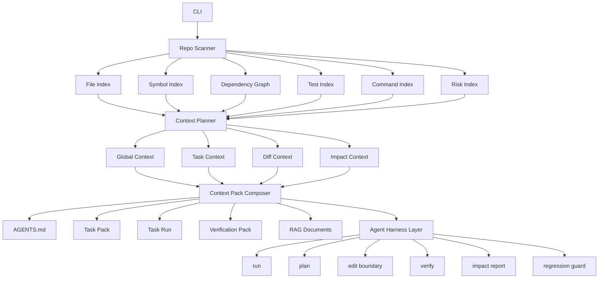

# Architecture

Repo-to-Agent-Context is an Agent Harness Runtime Control Plane for coding agents. It does not replace Codex, Claude Code, or Cursor as the coding agent; it compiles a repository into task-aware context, generates edit boundaries, records execution traces, checks policies and contracts, analyzes diff impact, recommends tests and verification paths, and decides the next loop action from freshness / trace / policy / impact signals.

The core product is no longer just documentation generation or context-pack compilation. It is a static but verifiable Agent Runtime Loop control plane:

```txt
Context -> Agent -> Execution -> Trace -> Evaluation -> Context Update -> Loop
```

The generated context remains important, but it is one part of the control plane: agents use it together with traces, policy checks, tests, freshness, drift, impact, and verification signals to plan, edit, repair, and finalize changes.

Current boundary: this is not yet a fully autonomous agent executor. It is a context, policy, trace, and runtime-state control plane with a semi-automatic loop advisor. The controller consumes repository state and trace evidence, persists `.agent-context/runs/<task-id>/state.json`, and decides the next allowed action, but an external coding agent or user still executes edits and commands. The roadmap is a more autonomous, evidence-driven Agent Harness Runtime.



## v2 Architecture

The v2 architecture is organized around five responsibilities:

- Repo Scanner: builds file, symbol, dependency, test, command, and risk indexes from repository evidence.
- Context Planner: converts repository indexes into global, task, diff, and impact contexts.
- Context Pack Composer: renders agent-consumable artifacts such as `AGENTS.md`, task packs, complete task runs, verification packs, editable contracts, and RAG documents.
- Agent Harness Layer: exposes task execution constraints through `run`, `plan`, edit boundaries, `verify`, impact reports, and regression guards.
- Integration Layer: exposes the same planning and retrieval contracts through the CLI, stdio MCP server, and retriever adapters. The MCP server scaffold and core tools exist today; editor and agent-client integrations are adapter targets that still need per-client validation. Current MCP tools include `repo_context_build`, `repo_context_plan`, `repo_context_pack`, `repo_context_retrieve`, `repo_context_tests`, `repo_context_impact`, `repo_context_verify`, `repo_context_explain`, plus experimental runtime loop tools for start/evaluate/repair/finalize flows.

This keeps the project distinct from repo summarizers, README generators, and raw RAG loaders. The goal is to help coding agents safely complete concrete changes, not just read a repository.

For a source-level walkthrough of the runtime loop, see [Loop Engineering Code Path](loop-engineering.md). The Chinese version is [Loop Engineering 源码链路](loop-engineering.zh-CN.md).

## Scanner

The scanner walks the repository while respecting `.gitignore` and built-in excludes for dependency folders, build artifacts, generated output, virtual environments, and common caches.

It detects:

- Languages
- Frameworks
- Package managers
- Config files
- Entrypoints
- Run and test commands
- Token estimates

Scanner output is normalized into indexes used by the planner:

- File Index: normalized path metadata, file kind, language, size, generated/lockfile flags, and summaries.
- Symbol Index: exports, functions, classes, routes, and evidence locations.
- Dependency Graph: file and module edges for imports, importers, and blast radius analysis.
- Test Index: test files, likely covered modules, runnable test commands, and changed-test shortcuts.
- Command Index: install, build, check, test, lint, dev, CI, and deployment commands.
- Risk Index: generated files, large modules, config boundaries, missing tests, cross-module edits, and low-confidence analysis.

## Indexer

The indexer reads source files and applies analyzers with explicit confidence and evidence:

- TypeScript Compiler API for TypeScript/JavaScript imports, `import type`, dynamic `import()`, re-exports, symbols, routes, barrel exports, `tsconfig` path aliases, workspace package aliases, and package `exports`
- Python optional Tree-sitter extraction when the runtime provides `tree_sitter` and `tree_sitter_python`, followed by stdlib AST fallback and lightweight parsing. The Python analyzer resolves local absolute/relative imports, functions, classes, and decorator routes.
- Generic metadata for all other files

Fallback analysis is marked low-confidence. Every indexed file carries `analysisStats` with the parser, resolved/unresolved import counts, symbol count, and route count. Evidence is exported to `.agent-context/evidence/file-evidence.json`.

Tree-sitter is intentionally introduced as an optional backend first. TypeScript/JavaScript stays on the TypeScript Compiler API because it provides stronger project-aware semantics today. Python uses Tree-sitter when available, with `python-ast` and regex fallback preserving portability. The next language targets are Go (`tree-sitter-go` plus `go.mod`), Rust (`tree-sitter-rust` plus `Cargo.toml`), Java (`tree-sitter-java` plus Maven/Gradle), and C/C++ (`tree-sitter-cpp` plus `compile_commands.json`).

The near-term focus is depth, not breadth. TypeScript/JavaScript should become materially better at Next.js app/router/pages routes, Express/Fastify/Hono/NestJS handlers, monorepo workspace boundaries, package `exports`/`imports`, `tsconfig` path aliases, and test-file-to-source relationships. Python should become materially better at FastAPI/Flask/Django routes, pytest fixtures, `pyproject.toml` scripts, local package imports, and CLI entrypoints before any broad expansion to more languages.

## Incremental Cache

The build pipeline uses `.agent-context/cache/` as a local incremental cache for large repositories and long-lived MCP/editor sessions:

- `file-hashes.json` stores content hashes plus size/mtime metadata so unchanged files can reuse previous hashes without rereading the file body.
- `index-cache.json` stores per-file analysis results keyed by file hash, analyzer, and dependency-resolution fingerprint.
- `graph-cache.json` stores dependency graph output keyed by an index fingerprint.
- `tokenizer-cache.json` stores token counts keyed by tokenizer, model, and text hash.

Dependency resolution is invalidated when package manifests, lockfiles, workspace files, `tsconfig.json`, `jsconfig.json`, or `pyproject.toml` change. Repository configuration changes rerender outputs while still allowing scan/index reuse. Task-only changes reuse the cached repository context and regenerate only plan, pack, run, verification, impact, or retrieval output. Git diff helpers filter `.agent-context/cache/**` so cache writes do not appear as affected source changes.

Command semantics are intentionally split:

- `repo-context update .`: full generated-context refresh, using scan/index/graph/token caches when available.
- `repo-context delta .`: analyzes changed files, stale context outputs, affected graph nodes, and agent re-read guidance without rewriting the full context.
- `repo-context evolve .`: currently performs a cache-aware full generated-context refresh, writes `.agent-context/delta/latest.*`, and prints cache stats such as reused indexed files, re-indexed files, graph reuse/rebuild, and rewritten outputs. Selective writing of only affected outputs is planned, not yet the default behavior.

## Graph Builder

The graph builder creates:

- File-level dependency edges
- Module-level dependency edges

Module names are inferred from path structure. For example, `src/auth/session.ts` belongs to the `auth` module.

## Ranker

The ranker scores files using repository signals:

- Entrypoint weight
- Configuration weight
- README/docs signal
- Exported symbol weight
- Symbol count
- Import centrality
- Test signal
- Generated/asset/lockfile penalty
- Analysis confidence

## Task Context

Task packs use a three-stage retrieval pipeline:

1. Direct retrieval matches task text against paths, module names, summaries, exports, symbols, tests, docs, and analysis evidence.
2. Graph expansion adds direct imports, direct importers, sibling tests, entrypoints, config files, and owning module docs.
3. Budget packing groups selected files into direct source, tests, dependency neighbors, config/docs, and entrypoints before rendering an executable agent workflow.

Bugfix, feature, and refactor tasks use different priorities and suggested commands.

`repo-context run "<task>" .` composes planning, task packing, edit boundaries, expected diff, tests, verification, impact, and agent prompts into one directory under `.agent-context/runs/<task-id>/`. A run does not edit code; it gives Codex, Claude Code, Cursor, or automation a single task execution context instead of several disconnected command outputs.

The planner now treats task context as one mode among four:

- Global Context: repository-wide operating rules, entrypoints, commands, boundaries, and onboarding.
- Task Context: suspected modules, must-inspect files, related tests, risk notes, and a task-specific prompt.
- Diff Context: changed files, changed modules, missing tests, and recommended verification after edits.
- Impact Context: direct/transitive dependents, related integration tests, risk score, and required verification.

These modes share the same indexes and scoring signals so CLI commands, future MCP tools, and editor integrations can produce consistent recommendations.

## Readiness

Readiness is a diagnostic, not a success guarantee. Low-level signal categories still include structure, commands, tests, architecture, task context, and safety. They roll up into Operational, Context Quality, and Agent Safety dimensions, then hard caps prevent easy 100s when important trust signals are missing, such as CI, real tokenizer accounting, high-confidence AST/compiler analysis, benchmark fixtures, or generated output validation.

## Token Accounting

Token savings are split into estimated and actual layers. `originalRepoTokens` is an estimate from scanned files, `estimatedContextPackTokens` is the theoretical compact context estimate, and `contextPackTokens` becomes an actual per-file count after generated Markdown, Mermaid, and RAG JSONL outputs are written. Real tokenizer modes use `js-tiktoken`; unsupported models fall back to `chars_approx`.

## Composer

The composer writes both human-friendly Markdown and machine-readable JSON:

- `AGENTS.manual.md` (hand-maintained source, never overwritten once created)
- `.agent-context/AGENTS.generated.md`
- `AGENTS.md`
- `.agent-context/manifest.json`
- `.agent-context/repo-summary.md`
- `.agent-context/key-files.md`
- `.agent-context/module-map.md`
- `.agent-context/dependency-graph.md`
- `.agent-context/architecture.md`
- `.agent-context/onboarding.md`
- `.agent-context/readiness.md`
- `.agent-context/tasks/*.md`
- `.agent-context/runs/<task-id>/*`
- `.agent-context/contracts/*.json`
- `.agent-context/index/*.json`
- `.agent-context/graphs/*.json`
- `.agent-context/graphs/*.mmd`
- `.agent-context/rag/*.jsonl`

When a legacy hand-written `AGENTS.md` already exists, the composer migrates deployment-oriented sections into `AGENTS.manual.md`, then composes the final root file from `agents.manualSources` plus `.agent-context/AGENTS.generated.md`.

Composer output is layered:

- `AGENTS.md`: minimal always-loaded rules and links.
- Task Run: complete task execution context under `.agent-context/runs/<task-id>/`.
- Task Pack: standalone task-specific context files under `.agent-context/tasks/`.
- Verification Pack: changed files, missing tests, recommended commands, and risk report.
- Contracts: machine-checkable edit boundaries under `.agent-context/contracts/`, validated by `repo-context validate-contracts`.
- RAG Documents: retrievable context chunks for static, ripgrep, LightRAG, embedding, or hybrid retrievers.

## Freshness And Drift

Every build writes `.agent-context/manifest.json` with `generatedAt`, `gitCommit`, `configHash`, `sourceHash`, `indexHash`, `graphHash`, `contractsHash`, `taskPacksHash`, `generatedOutputHash`, and `toolVersion`.

`repo-context freshness .` compares that manifest against the current repository scan and reports whether the generated context is fresh, stale, or missing. It catches source/config changes, commit changes, index drift, dependency graph drift, contract drift, task-pack drift, and hand-edited generated files.

`repo-context drift .` focuses on generated-output, dependency-graph, task-pack, and contract drift. This gives agents a fast preflight check before trusting `AGENTS.md`, task packs, or contracts.

## Loop Runtime Layer

The project is moving from a context compiler toward an agent runtime harness. The first runtime primitive is `repo-context loop "<task>" .`.

The loop controller does not execute an agent directly. It reads the compiled context, task pack, freshness manifest, dependency graph, contract validation, test selection, and impact report, then decides the next loop step:

- `start-agent`: clean preflight; create or use a task run before editing.
- `rebuild-context`: source/config/generated context is stale or drifted.
- `replan`: the task pack exceeds the context budget or needs a smaller boundary.
- `expand-context`: impact risk is high and the next turn needs dependents or related tests.
- `repair-contracts`: contract or edit-boundary violations are present.
- `add-or-update-tests`: changed source has missing-test signals.
- `run-tests`: the loop cannot close until focused tests or verification commands run.
- `ready-for-review`: no stale context, contract failures, changed files, or high-risk impact signals were detected.

Every decision includes a numeric confidence score, a `blocking` flag, and evidence signals such as changed-file counts, test counts, context freshness, drift status, contract violations, or impact dependents. This keeps the loop output useful for humans while giving coding agents a stable ordering and stop/go signal.

With `--write`, the controller writes `.agent-context/loops/<task-id>/loop.md` and `loop.json`, then updates `.agent-context/runs/<task-id>/state.json`. This is intentionally a control report plus explicit state machine rather than a hidden executor: agents still inspect source files and run commands explicitly, while the harness makes the next action visible and auditable. When `traceId` is provided, the controller consumes passed test evidence from the trace and can stop asking for `run-tests` once verification has been recorded.

The state file records `state`, `previousState`, repository/context/diff hashes, `lastAction`, the blocking `nextAction`, `allowedActions`, `satisfiedEvidence`, and `missingEvidence`. This gives MCP clients and coding agents a resumable runtime boundary instead of forcing them to infer progress from markdown.

## Execution Trace

Agent harnesses need structured history, not only generated context. `repo-context run "<task>" .` now creates `.agent-context/traces/<task-id>.json` alongside the task run, and `repo-context trace start/add/run/show` can manage traces directly.

Each trace records:

- task and agent identity
- ordered steps with timestamp, action, files, reason, command, test, result, and output summary
- evidence source: `manual`, `command`, or `ci`
- command evidence captured by `repo-context trace run`, including exit code, timestamps, stdout/stderr hashes, and working-tree hashes before and after execution
- final state such as `planned`, `in_progress`, `partial_success`, `success`, `failed`, or `blocked`

Trace steps are not trusted as raw logs. `evidenceSatisfies()` evaluates whether a trace step can satisfy a harness requirement by checking the requirement type, required command match, exit code, working-tree hash, and whether the evidence was recorded after the last edit step. Command/CI evidence must match the current actionable working-tree hash, excluding generated context and trace files, so a test run does not stay valid after later source edits.

Example:

```json
{
  "task": "fix login timeout bug",
  "steps": [
    {
      "agent": "codex",
      "action": "edit",
      "files": ["src/auth/session.ts"],
      "reason": "timeout logic"
    },
    {
      "action": "run-test",
      "command": "npm test -- auth",
      "result": "passed",
      "evidenceSource": "command",
      "capturedBy": "repo-context",
      "exitCode": 0,
      "startedAt": "2026-06-13T10:00:00.000Z",
      "finishedAt": "2026-06-13T10:00:04.000Z",
      "stdoutHash": "xx",
      "stderrHash": "xx",
      "workingTreeHashBefore": "xx",
      "workingTreeHashAfter": "xx"
    }
  ],
  "finalState": "success"
}
```

This gives the feedback loop durable evidence about what the agent actually did, so the Policy Engine can distinguish a manual claim from harness-captured command evidence or CI evidence. Later controller versions can use the same trace to distinguish missing context from failed execution, unsafe edits, or insufficient verification.

## Summary Engine

The summary engine has two modes:

- Offline mode: uses static repository signals and never calls an external model.
- LLM mode: uses a local private `repo-context.local.yml` with an OpenAI-compatible `baseUrl`, `apiKey`, and `model`.

Committed examples must keep `baseUrl`, `apiKey`, and `model` as `xx`. Real credentials belong only in `repo-context.local.yml`, which is ignored by git.

## Retrieval Protocol

RAG is represented as a stable retrieval protocol rather than a single framework integration. `ContextRetriever.search(task, options)` returns ranked `ContextHit` objects with path, module, kind, score, source, snippet, and metadata.

Built-in retrievers are:

- `static`: deterministic search over generated context documents, indexed files, symbols, summaries, and evidence.
- `ripgrep`: source-text retrieval through `rg` when it is available in the runtime.
- `hybrid`: score-level merge of static and ripgrep results.
- `lightrag`: external adapter slot for LightRAG services.
- `embedding`: external adapter slot for vector stores and embedding services.

The protocol is intended for MCP, VS Code, Cursor, Codex CLI, and external RAG systems. LightRAG remains an adapter target, not a core coupling.

## RAG Adapter

RAG is introduced as an optional adapter, not as a required core dependency.

The core package always produces deterministic static context first. The RAG adapter then exports agent-ready documents to `.agent-context/rag/documents.jsonl` for LightRAG ingestion.

This keeps the CLI fast and portable while still supporting semantic retrieval for large repositories.

Recommended LightRAG flow:

1. Run `repo-context build`.
2. Import `.agent-context/rag/documents.jsonl` into LightRAG.
3. Query LightRAG for task-specific context.
4. Feed retrieved snippets plus `AGENTS.md` into the coding agent.

## Design Principle

The MVP avoids LLM dependency. It should produce useful context in offline CI, local dev, and open-source workflows. LLM summaries can be layered on later as an optional enhancement.

Optional output groups are controlled by `outputs.*`. Disabling a group removes its previously generated artifacts. Core summaries, key files, token savings, onboarding, and machine-readable indexes are always generated.

## Loop Behavior Benchmark

The benchmark layer is now a behavior comparison, not only a context-quality metric. It compares four modes:

- A. `no-context`
- B. `agents-md`
- C. `context-pack`
- D. `loop-enabled-harness`

The report still includes retrieval signals such as Recall@K, Precision@K, token compression, and test recommendation accuracy, but the primary moat signal is behavior: fewer wrong file edits, fewer test failures, fewer steps per task, lower token usage, and fewer repair loops from A to D.

## Verification

```bash
npm run build
npm run check
npm run lint
npm run format
npm run format:check
npm test
npm run benchmark
npm run build
npm run pack:dry-run
```
