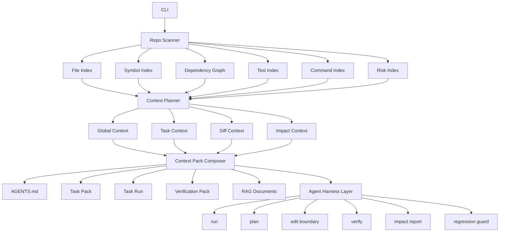

# Architecture

Repo-to-Agent-Context is an Agent Context Harness: it turns a repository into minimal, evidence-linked, task-aware context packs through a validation-oriented pipeline. The core product is not documentation generation; it is the context and guardrail system an agent uses to plan, edit, verify, and understand regression risk inside a repository.



## v2 Architecture

The v2 architecture is organized around five responsibilities:

- Repo Scanner: builds file, symbol, dependency, test, command, and risk indexes from repository evidence.
- Context Planner: converts repository indexes into global, task, diff, and impact contexts.
- Context Pack Composer: renders agent-consumable artifacts such as `AGENTS.md`, task packs, complete task runs, verification packs, editable contracts, and RAG documents.
- Agent Harness Layer: exposes task execution constraints through `run`, `plan`, edit boundaries, `verify`, impact reports, and regression guards.
- Integration Layer: lets the stdio MCP server, editor extensions, CLI adapters, and RAG backends call the same planning and retrieval contracts. The MCP server exposes `repo_context_build`, `repo_context_plan`, `repo_context_pack`, `repo_context_retrieve`, `repo_context_tests`, `repo_context_impact`, `repo_context_verify`, and `repo_context_explain`.

This keeps the project distinct from repo summarizers, README generators, and raw RAG loaders. The goal is to help coding agents safely complete concrete changes, not just read a repository.

## Scanner

The scanner walks the repository while respecting `.gitignore` and built-in excludes for dependency folders, build artifacts, generated output, virtual environments, and common caches.

It detects:

- Languages
- Frameworks
- Package managers
- Config files
- Entrypoints
- Run and test commands
- Token estimates

Scanner output is normalized into indexes used by the planner:

- File Index: normalized path metadata, file kind, language, size, generated/lockfile flags, and summaries.
- Symbol Index: exports, functions, classes, routes, and evidence locations.
- Dependency Graph: file and module edges for imports, importers, and blast radius analysis.
- Test Index: test files, likely covered modules, runnable test commands, and changed-test shortcuts.
- Command Index: install, build, check, test, lint, dev, CI, and deployment commands.
- Risk Index: generated files, large modules, config boundaries, missing tests, cross-module edits, and low-confidence analysis.

## Indexer

The indexer reads source files and applies analyzers with explicit confidence and evidence:

- TypeScript Compiler API for TypeScript/JavaScript imports, `import type`, dynamic `import()`, re-exports, symbols, routes, barrel exports, `tsconfig` path aliases, workspace package aliases, and package `exports`
- Python optional Tree-sitter extraction when the runtime provides `tree_sitter` and `tree_sitter_python`, followed by stdlib AST fallback and lightweight parsing. The Python analyzer resolves local absolute/relative imports, functions, classes, and decorator routes.
- Generic metadata for all other files

Fallback analysis is marked low-confidence. Every indexed file carries `analysisStats` with the parser, resolved/unresolved import counts, symbol count, and route count. Evidence is exported to `.agent-context/evidence/file-evidence.json`.

Tree-sitter is intentionally introduced as an optional backend first. TypeScript/JavaScript stays on the TypeScript Compiler API because it provides stronger project-aware semantics today. Python uses Tree-sitter when available, with `python-ast` and regex fallback preserving portability. The next language targets are Go (`tree-sitter-go` plus `go.mod`), Rust (`tree-sitter-rust` plus `Cargo.toml`), Java (`tree-sitter-java` plus Maven/Gradle), and C/C++ (`tree-sitter-cpp` plus `compile_commands.json`).

## Graph Builder

The graph builder creates:

- File-level dependency edges
- Module-level dependency edges

Module names are inferred from path structure. For example, `src/auth/session.ts` belongs to the `auth` module.

## Ranker

The ranker scores files using repository signals:

- Entrypoint weight
- Configuration weight
- README/docs signal
- Exported symbol weight
- Symbol count
- Import centrality
- Test signal
- Generated/asset/lockfile penalty
- Analysis confidence

## Task Context

Task packs use a three-stage retrieval pipeline:

1. Direct retrieval matches task text against paths, module names, summaries, exports, symbols, tests, docs, and analysis evidence.
2. Graph expansion adds direct imports, direct importers, sibling tests, entrypoints, config files, and owning module docs.
3. Budget packing groups selected files into direct source, tests, dependency neighbors, config/docs, and entrypoints before rendering an executable agent workflow.

Bugfix, feature, and refactor tasks use different priorities and suggested commands.

`repo-context run "<task>" .` composes planning, task packing, edit boundaries, expected diff, tests, verification, impact, and agent prompts into one directory under `.agent-context/runs/<task-id>/`. A run does not edit code; it gives Codex, Claude Code, Cursor, or automation a single task execution context instead of several disconnected command outputs.

The planner now treats task context as one mode among four:

- Global Context: repository-wide operating rules, entrypoints, commands, boundaries, and onboarding.
- Task Context: suspected modules, must-inspect files, related tests, risk notes, and a task-specific prompt.
- Diff Context: changed files, changed modules, missing tests, and recommended verification after edits.
- Impact Context: direct/transitive dependents, related integration tests, risk score, and required verification.

These modes share the same indexes and scoring signals so CLI commands, future MCP tools, and editor integrations can produce consistent recommendations.

## Readiness

Readiness is a diagnostic, not a success guarantee. Low-level signal categories still include structure, commands, tests, architecture, task context, and safety. They roll up into Operational, Context Quality, and Agent Safety dimensions, then hard caps prevent easy 100s when important trust signals are missing, such as CI, real tokenizer accounting, high-confidence AST/compiler analysis, benchmark fixtures, or generated output validation.

## Token Accounting

Token savings are split into estimated and actual layers. `originalRepoTokens` is an estimate from scanned files, `estimatedContextPackTokens` is the theoretical compact context estimate, and `contextPackTokens` becomes an actual per-file count after generated Markdown, Mermaid, and RAG JSONL outputs are written. Real tokenizer modes use `js-tiktoken`; unsupported models fall back to `chars_approx`.

## Composer

The composer writes both human-friendly Markdown and machine-readable JSON:

- `AGENTS.manual.md` (hand-maintained source, never overwritten once created)
- `.agent-context/AGENTS.generated.md`
- `AGENTS.md`
- `.agent-context/repo-summary.md`
- `.agent-context/key-files.md`
- `.agent-context/module-map.md`
- `.agent-context/dependency-graph.md`
- `.agent-context/architecture.md`
- `.agent-context/onboarding.md`
- `.agent-context/readiness.md`
- `.agent-context/tasks/*.md`
- `.agent-context/runs/<task-id>/*`
- `.agent-context/contracts/*.json`
- `.agent-context/index/*.json`
- `.agent-context/graphs/*.json`
- `.agent-context/graphs/*.mmd`
- `.agent-context/rag/*.jsonl`

When a legacy hand-written `AGENTS.md` already exists, the composer migrates deployment-oriented sections into `AGENTS.manual.md`, then composes the final root file from `agents.manualSources` plus `.agent-context/AGENTS.generated.md`.

Composer output is layered:

- `AGENTS.md`: minimal always-loaded rules and links.
- Task Run: complete task execution context under `.agent-context/runs/<task-id>/`.
- Task Pack: standalone task-specific context files under `.agent-context/tasks/`.
- Verification Pack: changed files, missing tests, recommended commands, and risk report.
- Contracts: machine-checkable edit boundaries under `.agent-context/contracts/`, validated by `repo-context validate-contracts`.
- RAG Documents: retrievable context chunks for static, ripgrep, LightRAG, embedding, or hybrid retrievers.

## Summary Engine

The summary engine has two modes:

- Offline mode: uses static repository signals and never calls an external model.
- LLM mode: uses a local private `repo-context.local.yml` with an OpenAI-compatible `baseUrl`, `apiKey`, and `model`.

Committed examples must keep `baseUrl`, `apiKey`, and `model` as `xx`. Real credentials belong only in `repo-context.local.yml`, which is ignored by git.

## Retrieval Protocol

RAG is represented as a stable retrieval protocol rather than a single framework integration. `ContextRetriever.search(task, options)` returns ranked `ContextHit` objects with path, module, kind, score, source, snippet, and metadata.

Built-in retrievers are:

- `static`: deterministic search over generated context documents, indexed files, symbols, summaries, and evidence.
- `ripgrep`: source-text retrieval through `rg` when it is available in the runtime.
- `hybrid`: score-level merge of static and ripgrep results.
- `lightrag`: external adapter slot for LightRAG services.
- `embedding`: external adapter slot for vector stores and embedding services.

The protocol is intended for MCP, VS Code, Cursor, Codex CLI, and external RAG systems. LightRAG remains an adapter target, not a core coupling.

## RAG Adapter

RAG is introduced as an optional adapter, not as a required core dependency.

The core package always produces deterministic static context first. The RAG adapter then exports agent-ready documents to `.agent-context/rag/documents.jsonl` for LightRAG ingestion.

This keeps the CLI fast and portable while still supporting semantic retrieval for large repositories.

Recommended LightRAG flow:

1. Run `repo-context build`.
2. Import `.agent-context/rag/documents.jsonl` into LightRAG.
3. Query LightRAG for task-specific context.
4. Feed retrieved snippets plus `AGENTS.md` into the coding agent.

## Design Principle

The MVP avoids LLM dependency. It should produce useful context in offline CI, local dev, and open-source workflows. LLM summaries can be layered on later as an optional enhancement.

Optional output groups are controlled by `outputs.*`. Disabling a group removes its previously generated artifacts. Core summaries, key files, token savings, onboarding, and machine-readable indexes are always generated.

## Verification

```bash
npm run build
npm run check
npm run lint
npm run format
npm run format:check
npm test
npm run benchmark
npm run build
npm run pack:dry-run
```
