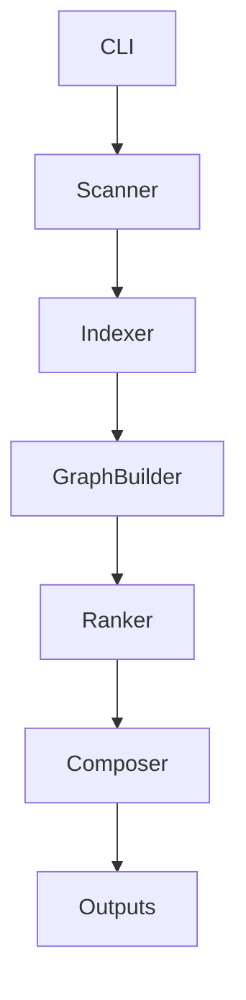

# Architecture

Repo-to-Agent-Context turns a repository into a compact context package through a six-stage pipeline.

## Scanner

The scanner walks the repository while respecting `.gitignore` and built-in excludes for dependency folders, build artifacts, generated output, virtual environments, and common caches.

It detects:

- Languages
- Frameworks
- Package managers
- Config files
- Entrypoints
- Run and test commands
- Token estimates

## Indexer

The indexer reads source files and applies lightweight language analyzers. The MVP supports:

- TypeScript and JavaScript imports, exports, classes, functions, types, interfaces, constants, and route-like calls
- Python imports, functions, async functions, and classes
- Generic metadata for all other files

Future versions can replace or augment these analyzers with Tree-sitter.

## Graph Builder

The graph builder creates:

- File-level dependency edges
- Module-level dependency edges

Module names are inferred from path structure. For example, `src/auth/session.ts` belongs to the `auth` module.

## Ranker

The ranker scores files using repository signals:

- Entrypoint weight
- Configuration weight
- README/docs signal
- Exported symbol weight
- Symbol count
- Import centrality
- Test signal
- Generated/asset/lockfile penalty

## Composer

The composer writes both human-friendly Markdown and machine-readable JSON:

- `AGENTS.md`
- `.agent-context/repo-summary.md`
- `.agent-context/key-files.md`
- `.agent-context/module-map.md`
- `.agent-context/dependency-graph.md`
- `.agent-context/architecture.md`
- `.agent-context/onboarding.md`
- `.agent-context/index/*.json`
- `.agent-context/graphs/*.json`
- `.agent-context/graphs/*.mmd`

## Design Principle

The MVP avoids LLM dependency. It should produce useful context in offline CI, local dev, and open-source workflows. LLM summaries can be layered on later as an optional enhancement.
