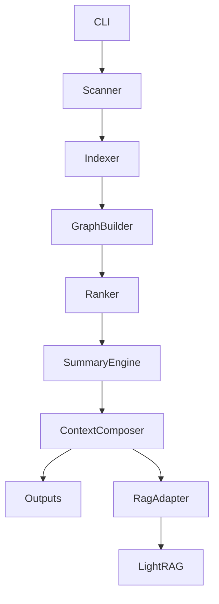

# Architecture

Repo-to-Agent-Context is an Agent Context Harness: it turns a repository into minimal, evidence-linked, task-aware context packs through a validation-oriented pipeline.



## Scanner

The scanner walks the repository while respecting `.gitignore` and built-in excludes for dependency folders, build artifacts, generated output, virtual environments, and common caches.

It detects:

- Languages
- Frameworks
- Package managers
- Config files
- Entrypoints
- Run and test commands
- Token estimates

## Indexer

The indexer reads source files and applies analyzers with explicit confidence and evidence:

- TypeScript Compiler API for TypeScript/JavaScript imports, `import type`, dynamic `import()`, re-exports, symbols, routes, barrel exports, `tsconfig` path aliases, workspace package aliases, and package `exports`
- Python stdlib AST extraction when a Python runtime is available, including local absolute/relative import resolution, functions, classes, and decorator routes; lightweight parsing remains the fallback
- Generic metadata for all other files

Fallback analysis is marked low-confidence. Every indexed file carries `analysisStats` with the parser, resolved/unresolved import counts, symbol count, and route count. Evidence is exported to `.agent-context/evidence/file-evidence.json`.

## Graph Builder

The graph builder creates:

- File-level dependency edges
- Module-level dependency edges

Module names are inferred from path structure. For example, `src/auth/session.ts` belongs to the `auth` module.

## Ranker

The ranker scores files using repository signals:

- Entrypoint weight
- Configuration weight
- README/docs signal
- Exported symbol weight
- Symbol count
- Import centrality
- Test signal
- Generated/asset/lockfile penalty
- Analysis confidence

## Task Context

Task packs use a three-stage retrieval pipeline:

1. Direct retrieval matches task text against paths, module names, summaries, exports, symbols, tests, docs, and analysis evidence.
2. Graph expansion adds direct imports, direct importers, sibling tests, entrypoints, config files, and owning module docs.
3. Budget packing groups selected files into direct source, tests, dependency neighbors, config/docs, and entrypoints before rendering an executable agent workflow.

Bugfix, feature, and refactor tasks use different priorities and suggested commands.

## Readiness

Readiness is a diagnostic, not a success guarantee. Low-level signal categories still include structure, commands, tests, architecture, task context, and safety. They roll up into Operational, Context Quality, and Agent Safety dimensions, then hard caps prevent easy 100s when important trust signals are missing, such as CI, real tokenizer accounting, high-confidence AST/compiler analysis, benchmark fixtures, or generated output validation.

## Token Accounting

Token savings are split into estimated and actual layers. `originalRepoTokens` is an estimate from scanned files, `estimatedContextPackTokens` is the theoretical compact context estimate, and `contextPackTokens` becomes an actual per-file count after generated Markdown, Mermaid, and RAG JSONL outputs are written. Real tokenizer modes use `js-tiktoken`; unsupported models fall back to `chars_approx`.

## Composer

The composer writes both human-friendly Markdown and machine-readable JSON:

- `AGENTS.manual.md` (hand-maintained source, never overwritten once created)
- `.agent-context/AGENTS.generated.md`
- `AGENTS.md`
- `.agent-context/repo-summary.md`
- `.agent-context/key-files.md`
- `.agent-context/module-map.md`
- `.agent-context/dependency-graph.md`
- `.agent-context/architecture.md`
- `.agent-context/onboarding.md`
- `.agent-context/readiness.md`
- `.agent-context/tasks/*.md`
- `.agent-context/index/*.json`
- `.agent-context/graphs/*.json`
- `.agent-context/graphs/*.mmd`

When a legacy hand-written `AGENTS.md` already exists, the composer migrates deployment-oriented sections into `AGENTS.manual.md`, then composes the final root file from `agents.manualSources` plus `.agent-context/AGENTS.generated.md`.

## Summary Engine

The summary engine has two modes:

- Offline mode: uses static repository signals and never calls an external model.
- LLM mode: uses a local private `repo-context.local.yml` with an OpenAI-compatible `baseUrl`, `apiKey`, and `model`.

Committed examples must keep `baseUrl`, `apiKey`, and `model` as `xx`. Real credentials belong only in `repo-context.local.yml`, which is ignored by git.

## RAG Adapter

RAG is introduced as an optional adapter, not as a required core dependency.

The core package always produces deterministic static context first. The RAG adapter then exports agent-ready documents to `.agent-context/rag/documents.jsonl` for LightRAG ingestion.

This keeps the CLI fast and portable while still supporting semantic retrieval for large repositories.

Recommended LightRAG flow:

1. Run `repo-context build`.
2. Import `.agent-context/rag/documents.jsonl` into LightRAG.
3. Query LightRAG for task-specific context.
4. Feed retrieved snippets plus `AGENTS.md` into the coding agent.

## Design Principle

The MVP avoids LLM dependency. It should produce useful context in offline CI, local dev, and open-source workflows. LLM summaries can be layered on later as an optional enhancement.

Optional output groups are controlled by `outputs.*`. Disabling a group removes its previously generated artifacts. Core summaries, key files, token savings, onboarding, and machine-readable indexes are always generated.

## Verification

```bash
npm run build
npm run check
npm test
```
